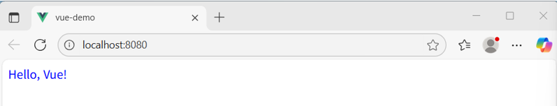
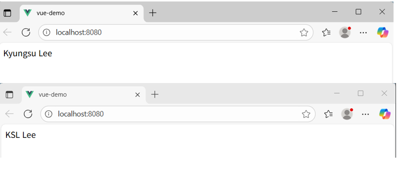
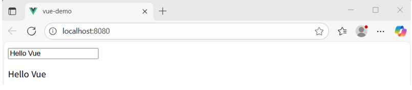
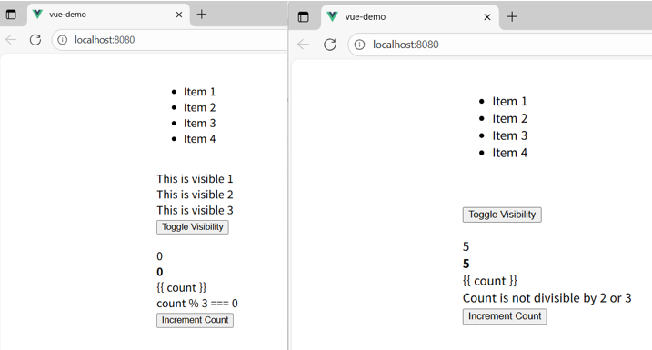
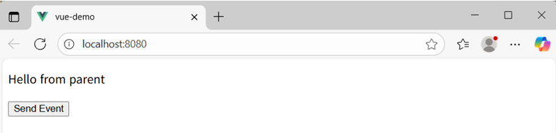
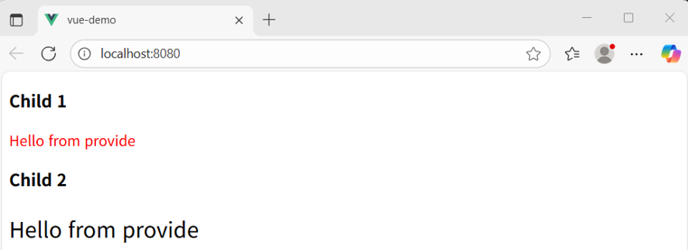
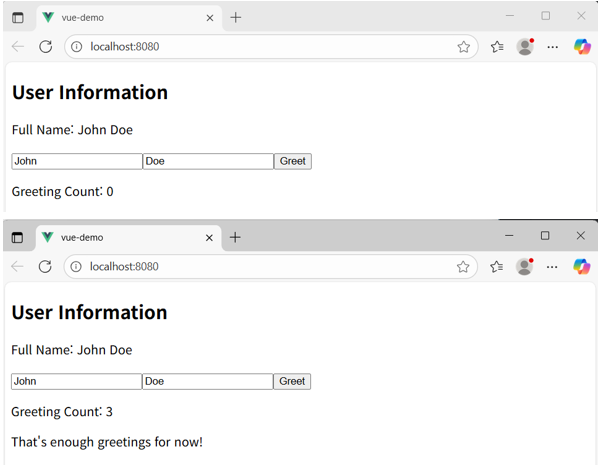

# PB_demo — Vue2 → Vue3 변환

이 프로젝트는 Vue2로 작성된 예제를 Vue3 Composition API로 변환한 실습입니다.  
요구사항에 따라 **변경된 예제(1~7)** 에 대해서만 변경 요약 및 실행 화면을 포함했습니다.

---

## 변경 요약 (Vue2 → Vue3)

| 예제 | 변경 내용 요약 |
|---|---|
E01 | `data()` → `ref()` 사용하여 반응형 상태 정의 |
E02 | `computed` → `computed()` 훅으로 변경, `mounted` → `onMounted` |
E03 | `v-model` 유지, `data()` → `ref()`, Composition API 구조로 변환 |
E04 | `v-if`, `v-for`, `v-show` 등 지시자 동일 사용 + `ref()`로 상태 구성 |
E05 | `props` + `$emit` → `defineProps` / `emit()` 기반 Composition 방식으로 리팩터링 |
E06 | `provide/inject` → `provide()` / `inject()` API 사용 |
E07 | Options API 로직을 `ref`, `computed`, `watch`, Composition lifecycle 훅으로 변환 |

> 💡 모든 예제는 **UI / 동작 동일 유지**  
> (리팩터링 목적: 코드 구조만 Vue3 방식으로 변경)

---

## 동작 확인 (예제 1~7)

| Example | Screenshot |
|---|---|
E01 |  |
E02 |  |
E03 |  |
E04 |  |
E05 |  |
E06 |  |
E07 |  |

